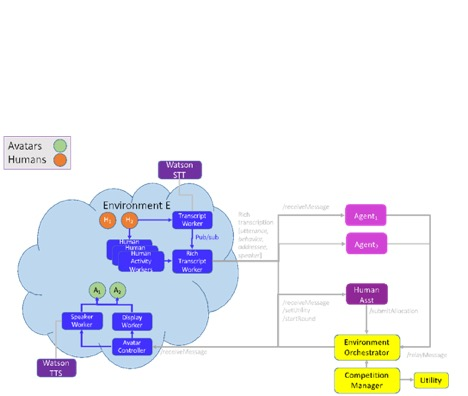
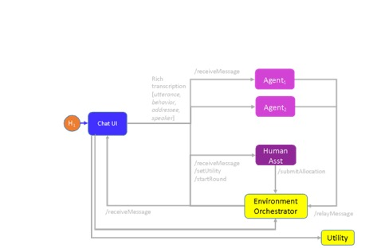
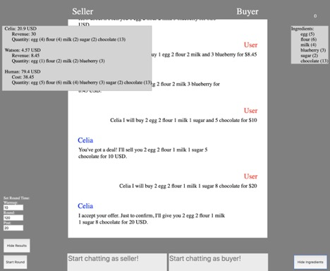
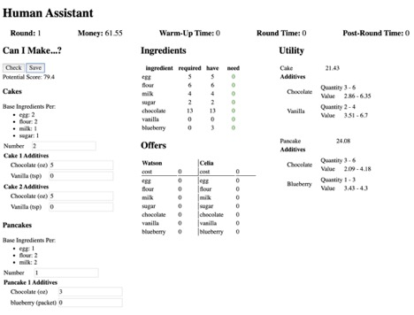
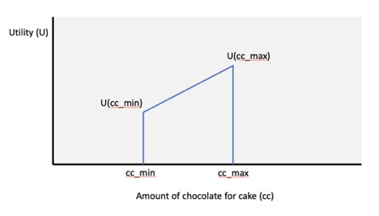
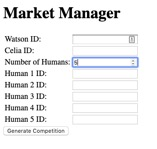

## HUMAINE Technical Documentation

### Introduction

HUMAINE (HUman Multi-Agent Immersive NEgotiation) is a new ANAC (Automated Negotiating Agents Competition) league that will premiere at the International Joint Conference on Artificial Intelligence in Yokohama, Japan in July 2020.

In this competition, a human buyer wishes to purchase various ingredients from which cakes and pancakes can be made and negotiates with two competing seller agents to obtain them. The action takes place in an immersive environment, in which the agents are rendered as avatars on a display, and the human interacts with them by speaking (in English) and looking at the one with whom they wish to negotiate. The negotiation platform uses a speech-to-text service to render the audio into text and a head-pose estimation system to infer the addressee and passes that information to each agent. Each agent must detect the intent of the utterance, select an appropriate negotiation act (such as a counteroffer, an acceptance, or a rejection) in light of the intent of the utterance and any other relevant context, and determine how best to render that act into an utterance and an accompanying gesture. Upon receiving this message from the agent and checking it for compliance with competition rules, the platform causes the avatar to behave and speak as specified by the agent. The winning agent is the one that best maximizes its utility across multiple rounds of negotiation with various humans and other agents.

An example interaction video can be found here:

[https://www.youtube.com/watch?v=KBV9z9fLAD0&amp;feature=emb\_title](https://www.youtube.com/watch?v=KBV9z9fLAD0&amp;feature=emb_title)

The remainder of this document provides detailed information about the tournament, how individual negotiation rounds are conducted, the negotiation platform architecture and how the negotiating agents fit into it, and information about how to build and test your own negotiating agent in preparation for the competition. Appendices A, B, and C provide additional information that agent developers will find useful, regarding utility functions, turn-taking rules, and API details with pointers to sample code, respectively. Human participants will find Appendix D useful as a stand-alone guide to haggling with agents, while tournament masters will find useful information in Appendix E regarding how to administer the tournament.

### 1. Tournament overview

The competition's winner agent is determined by accumulating its utility across a set of 5- or 10-minute rounds during which it interacts with different humans and other competing agents in different rounds, i.e., the two competitive agents interact with one human at a time. An agent's utility is its profit -- the difference between the price for which it sells ingredients and those ingredients' production cost (which is generated randomly for each round). Human buyers are also awarded according to profit. They have a utility function that represents the price for which they will be able to sell the cakes and pancakes they choose to make from the ingredients they have purchased. Like the sellers agents, they are rewarded according to their ability to maximize their utility (profit) during the competition. Humans are thus incentivized to drive as hard a bargain as possible, without running the risk of failing to reach an agreement with at least one agent.

Although the agent winner is determined by accumulated utility, the fact that the contest involves humans suggests that the most effective agents will be those that combine algorithmic prowess with social skills (e.g.. being fun, pleasant, or subtly manipulative), which requires sophisticated dialogues or agents&#39; utterances responses.

The tournament will be conducted in two stages: pool play and championship play. During pool play, the contestants will be divided into two or more pools. If the number of agents is not even, then an additional dummy agent will be supplied by the organizers to fill out one of the pools so that they each contain the same number. Within each pool, each player will play each of the other players for exactly two rounds, to be scheduled randomly so that the identity of their opponent will not be known to the agents. After pool play is complete, one or two agents with the highest accumulated utility in each pool will move on to the championship round, which will consist of longer multi-round matches against opponents in semi-finals and finals.

Winning agents will receive cash prizes, and winning humans will have their names announced at the conference. A prize will also be awarded to an agent that is judged to be most socially adept or engaging (regardless of its accumulated utility).

### 2. Architecture

Figure 1 provides a high-level view of HUMAINE&#39;s multi-modal multi-agent negotiation platform architecture:

 
 
_Figure 1. Simplified view of HUMAINE&#39;s multi-agent multi-modal architecture._

The cloud on the left-hand side of this figure depicts the physical environment, containing the human negotiator H2 and two avatars A1 and A2. In that environment are various workers (provided by the HUMAINE platform) that collect audio and other sensor signals and process them into a representation of H2&#39;s utterance and certain aspects of H2&#39;s non-verbal behavior. The non-verbal behavior includes at a minimum an inference about the addressee Ð that is, the avatar who was addressed by the human, which is derived from head pose information based on camera data. In the future, it may also include information about human gestures and facial expressions.

The Rich Transcript Worker collates and formatts the verbal and non-verbal behavior of humans into a JSON structure that contains the utterance, addressee, speaker, and (optionally) additional behavioral information. It delivers this structure to all of the agents by calling their /receiveMessage APIs.

Then, the agents processes received messages and determine whether to respond, and if so what message to send to the Environment Orchestrator which encapsulates the response with the bid. This message could be an offer or counteroffer, acceptance or rejection of an offer, etc. The agent sends that message to the Environment Orchestrator by calling the Environment Orchestrator&#39;s /relayMessage API.

The Environment Orchestrator decides whether to permit the relayed message to be broadcasted to the rest of the system. If the decision is to permit the message to be forwarded, the Environment Orchestrator calls the /receiveMessage API on all agents, just as the Rich Transcript worker does for messages generated by the human negotiator. It also calls the /receiveMessage API of an Avatar Controller located within the environment, which in turn delegates displaying the avatar and playing synthesized speech to a Display worker and a Speaker worker, respectively.

A Competition Manager manages the competition as a whole by calling the Utility service to generate utility functions for the agents and humans in the system, storing them, and permuting them across different rounds to achieve fairness for agents and humans. A human administrator may use the Competition Manager to send a signal to the Environment Orchestrator signifying that a round is to start.

The Human Assistant service is a tool that human negotiators can use to aid them in deciding what offers to make, and how to allocate their purchased goods into cakes and pancakes when the negotiation phase of the round is complete.


### 3. Negotiation round details

## Overview of a round

There are three players in each round: two seller agents and a human buyer. Each player strives to maximize their utility during each round. Sellers strive to sell goods for a price as far above their unit cost as possible, while buyers seek to use a budget given to them at the beginning of the round to buy goods from which they can make the most valuable set of cakes or pancakes that they&#39;re able to make from their purchases. In order to maximize the number cakes and/or pancakes that they can make, buyers have an incentive to maximize the number of goods they can purchase, and thus they must try to purchase goods as cheaply as they can.

The seller&#39;s utility function is expressed in terms of a unit cost c_g for each of several different goods g that it can offer to the buyer. The set of goods is as follows:

- Eggs (unit: each)
- Milk (unit: cup)
- Sugar (unit: cup)
- Flour (unit: cup)
- Chocolate (unit: ounce)
- Vanilla (unit: teaspoon)
- Blueberries (unit: packe

When an agent sells a bundle {n_egg, n_milk, n_sugar, ...} consisting of n_g items of good g for a price p, the agent&#39;s utility can be computed as

Seller utility = p - Sum_g n_g c_g

Where Sum_g n_g c_g is the cost of all goods in the bundle.

The human buyer&#39;s utility is based upon the number of cakes and pancakes they can make from the goods they purchase from the sellers' agents during the round, with some extra value placed on extra flavorings: chocolate, vanilla and blueberries. The mapping from raw goods to baked goods is a fixed recipe that is known to all players. Specifically, the recipes are:

A cake can be made from:

- 2 eggs
- 2 cups flour
- 1 cup milk
- 1 cup sugar
- Optional additives: Chocolate (in ounces) or Vanilla (in teaspoons).

A batch of pancakes can be made from:

- 1 egg
- 2 cups flour
- 2 cups milk
- Optional additives: Chocolate (in ounces) or Blueberries (in packets).

At the beginning of the round, the human buyer is given a budget. They should try to exhaust their budget as best they can, as no credit is given for any money left over at the end of the round.

There is no carry-over from one round to another: the players have no way to recognize whether or when they are playing against an opponent they have met previously, and the utility functions are drawn randomly prior to each round, so that nothing can be learned from one round to another.

While each player is aware of the general structure of the other players&#39; utility functions and the distribution from which the parameters of those utility functions are drawn, none of the players know the other players&#39; exact utilities during a given round.

## Prior to the round

Just before the round starts, each player is sent a randomly-generated utility function that describes the cost or value of an item. See Appendix A for details of the distribution from which the parameters of the seller and buyer utility functions are drawn. The seller agents must implement a /setUtility API through which the system informs them about

- their utility function
- round parameters (such as the round duration and the length of the warmup period, both in seconds)
- the name by which the agent will be known (Celia Ð represented as a female avatar with a female voice, or Watson Ð represented as a male avatar with a male voice). Agent developers may or may not decide to generate negotiation bids in such a way as to reflect gender.

An example seller agent that implements this API and others referred to in this Technical Details section, called agent-jok, is provided with the HUMAINE code distribution.

Humans are provided with a simple tool, called Human Assistant UI, that aids them in their negotiation with sellers agents; this tool also receives information about the human utility and the round parameters.


Once the human buyer starts the round through this tool, a short warmup period in seconds then ensues, during which the human buyer can think about their negotiation strategy. Then, the agents and the Human Assistant UI are informed when the round has started and the elapsed time in seconds for the current round is displayed and the dialogue can begin with the negotiating. Because of that, the agents must implement a /startRound API so that they can receive this message from the system (see the agent-jok example in the HUMAINE code distribution).

## During the round

Once the round has begun, the human buyer starts by requesting a bundle of one or more goods. The buyer may be precise or imprecise about exactly how much they want of each good, and they may or may not propose a price for that bundle. Examples of phrases that might be uttered include:

- I&#39;d like to buy 3 eggs, 2 cups of sugar, 4 cups of milk and 5 ounces of chocolate.
- Can anyone give me a good price on blueberries?
- Celia, I&#39;ll buy 2 cups of flour, 2 cups of sugar, and 2 cups of milk from you for $3.
- Watson, can you sell me some milk and sugar?

The seller agent will receive utterances as a call to a /receiveMessage API that they must implement. Details and example code are provided on agents agent-jok and agent-kleen. Upon receiving the message, the seller agent should try to interpret its meaning, i.e. ascertain the type of negotiation act (offer/counteroffer, reject, accept, etc.) and the associated parameters. To do this, the seller agent should try to anticipate different ways in which buyers might start a negotiation and strive to recognize their intent accurately. One service you may want to consider using to aid in this task is Watson Assistant. The sample agent agent-jok uses this approach, and you are welcome to borrow that routine if you wish Ð just remember that you need to create your own IBM Cloud account, set up the Watson Assistant Service with your private API key and other information, and create your dialogue skill. You are welcome to start from the simple skill provided as JSON in the agent-jok code repository; you can upload this skill to our Watson Assistant Service instance.Note that human buyers will have an incentive to make themselves understood to the seller agents, so it is unlikely that they will deliberately express themselves in an obscure or confusing manner.

Once the agent has interpreted the message, it needs to consider whether and how to respond to it as follows:

(i) Should the agent respond to the received task? This question can be answered by first understanding the message and then analyzing the turn taking rules.

(ii) How to respond depends on the implementation of a bidding algorithm that computes a bid or other negotiation act that is intended to maximize its utility over the course of the round. It may well want to store messages that it has received during the round to aid it in this task. 

In addition to receiving utterances from the human buyer, the agent will also receive (via the /receiveMessage API) a copy of negotiation messages exchanged between the human buyer and the other seller agent.

Finally, the seller agent needs to determine how best to express its intended negotiation act in a human-friendly form, consisting of text plus an optional specification of avatar behavior, such as &quot;smile&quot; or &quot;wave&quot;. The text may include SSML tags that allow for some expressiveness. Documentation for SSML may be found in the documentation for [Watson Text to Speech](https://cloud.ibm.com/docs/services/text-to-speech?topic=text-to-speech-ssml&amp;_ga=2.41390498.1876685034.1582841951-1115111321.1579580147&amp;_gac=1.185765339.1582841951.CjwKCAiA7t3yBRADEiwA4GFlI0RB95qHdAaZ2LFtsPwmlZD7SHa3XwUmNuETvRaHukZV9qKzZ8IODhoCvYcQAvD_BwE&amp;cm_mc_uid=15278110739115689857415&amp;cm_mc_sid_50200000=20950731577973297095&amp;cm_mc_sid_52640000=33641591577973297117#introduction-SSML). 

Eventually, after computing the bid and a human-friendly response with the negotiation action in natural language, the agent can evaluate the turn taking rules again before sending the generated bid.

Whenever it is ready, the agent may submit its negotiation action by calling the system&#39;s /relayMessage API. This message contains the bid in structured form and in human-friendly form. The structured form is used by the system only; the other agent will only see the human-friendly part of the message.

Finally, when the system receives the seller agent&#39;s bid, it applies a set of turn-taking rules to determine whether the message abides by those rules. These rules are described in detail in Appendix B. If a proposed message is allowed, the system forwards it to the software that causes the avatar to speak and act, and it also forwards the message to the other agent and the human buyer assistant UI. If the proposed message is not allowed, the system informs that agent that its message has been rejected, so that it can take this into account going forward. While the system prevents illegal messages from flowing, it behooves agent developers to endow their agent with an understanding of these rules, so that it can take them into account properly in its strategy.

Buyers or sellers may make offers or counteroffers, or accept bids, or reject bids. The buyer assistant includes a button that allows the buyer to confirm an offer that has been accepted by either the buyer or the seller.

Once a bid has been accepted, the buyer may continue to initiate negotiation for additional goods in an effort to add to the collection of raw goods from which they will make their baked goods. Negotiation activity may continue until either the round has ended or the buyer has fully exhausted their budget.

## Post bidding phase

When a round ends, the human buyer is given 2 minutes to decide how to allocate their purchased goods into cakes and pancakes, possibly with additional flavorings. They must be able to make an integer number of cakes or pancake batches; extra leftover ingredients that are not enough to make another cake or pancake batch will be worth nothing. For example, if the human has enough to bake 3 cakes with one egg left over, that one egg would be worth nothing. The buyer assistant tool provides a calculator that helps the buyer determine the overall value of any given allocation. When the buyer is ready, they press the &quot;Submit Allocation&quot; button.

Once the human buyer submits their allocation, the seller agent&#39;s utilities and the human buyer&#39;s utility are computed for that round, and added to each player&#39;s tournament totals.

### 4. Building and Testing Your Own HUMAINE Agent

## Building your agent

In order to build your own agent, you must implement it as a service. That service must support

the following APIs, which are called on your agent by the Environment Orchestrator in order to inform your agent about important events and messages that occur prior to or during a negotiation round:

- POST /setUtility. Establishes the utility for the agent just before the round starts. It may also contain the name to be used by the agent.
- POST /startRound. Informs the agent that a new round has begun, and provides information about the duration and the round number.

- POST /endRound. Informs the agent that the current round has ended. Beyond this point, no offers can be sent or received.
- POST /receiveMessage. Receives a message, interprets it, decides how to respond (e.g. Accept, Reject, or counteroffer), and if it desires sends a separate message to the /relayMessage route of the environment orchestrator.
- POST /receiveRejection. Signifies that the Environment Orchestrator has not accepted a message that the agent recently relayed to it.

In order to communicate with the system, your agent must call the Environment Orchestrator&#39;s POST /relayMessage API.

More detailed information about expected formats for POST bodies and responses can be found in Appendix C.

As an aid to developing your agent, and for details about the APIs, we recommend that you take a look at two example agents that are designed to run on the HUMAINE platform. You may borrow any code you like from these agents, which are intentionally designed with relatively weak capabilities.

- **agent-jok**. This agent uses Watson Assistant to help interpret human text as a negotiation message. To use this agent, yu will need to create your own IBM Cloud account (for free), sign up for the free Watson Assistant service, and create a skill by uploading a JSON file contained in the repository. Then you will edit the assistantParams.json file to include a URL and two randomly-generated keys that are provided when you sign up for the service. The agent uses a very simple semi-random algorithm to generate counteroffers. The README for this agent contains details on all of the required APIs and their input and output JSON formats. It is available at [https://github.com/humaine-anac/agent-jok](https://github.com/humaine-anac/agent-jok).
- **agent-kleene**. This agent uses simple regular expressions to interpret human text as negotiation messages, and uses a random counteroffer strategy. It is available at [https://github.com/humaine-anac/agent-kleene](https://github.com/humaine-anac/agent-kleene).

## Testing your agent

For the purpose of testing your agent, we have provided a collection of services from which you can create a small test environment. The test environment replaces the physical environment depicted in the HUMAINE architecture with a simple chat tool that allows you to interact with one of two agents: &quot;Celia&quot; and &quot;Watson&quot;, by typing utterances in a Chat UI.

Figure 2 illustrates the test platform:

 
 
_Figure 2. Simplified architecture of HUMAINE&#39;s test platform -- a stripped-down version of the full competition architecture of Figure 1._

It is worthwhile to compare the test platform architecture of Figure 2 with the full-compeition negotiation platform depicted in Figure 1. All of the message formats are exactly as they are in the full competition platform. The differences lie only in the user experience and the services from which the messages are received, and are summarized as follows:

- The test platform does not support speech recognition. Instead, the human buyer types text into the Chat UI.
- The test platform provides neither speech synthesis nor avatars. Instead, the agent&#39;s behavior is shown as seller messages displayed in the Chat UI.
- In the test platform, the Chat UI stands in the place of the Rich Transcript worker. It calls the /receiveMessage API of all of the agents to send them messages from the human buyer.
- In the test platform, the Chat UI stands in the place of the Competition Manager. It provides buttons that allow a human to launch a single negotiation round, and displays results when the round is over. One cannot use the Chat UI to simulate a competition; it only handles one round at a time. In its role as substitute Competition Manager, the Chat UI calls the Utility service to randomly generate utilities at the beginning of a round, and calls the Environment Orchestrator to launch a round.

To set up the test environment, you first need to get the HUMAINE platform running. There are two approaches:

1. The all-in-one: Go to https://github.com/humaine-anac/application/releases/latest and you will find pre-built binaries for Windows, macOS, and Linux. You can just download and run it directly, without requiring installation of any dependencies. When you run it, it will start-up the environment-orchestrator, utility-generator, chat-ui, and human-ui and their related endpoints will be available.

2. The old-fashioned way: go to https://github.com/humaine-anac/, where you will find the repositories for the following components; do a git clone on each and follow the instructions in their individual READMEs to install and configure them:
  - environment-orchestrator
  - utility-generator
  - chat-ui
  - human-ui
  
The second task is to install and configure the agents. Three sample agents are provided:
  - agent-jok
  - agent-py
  - agent-kleene
  
Do a git clone of any of these repositories that you want to try, and follow the instructions in their README to install and configure them for your computer.

Make sure that you run two agents. To start with, you could run two copies of agent-jok or agent-kleene at different ports. Then, as soon as you have your own agent to test, you should substitute yours for one or both of the test agents that we supply.

In your browser, start up one window at http://localhost:2500 and another at http://localhost:7040. These will be the chat-ui and the human-ui, respectively.

Figure 3 is a screenshot of the chat UI tool provided with the test environment (at localhost:2500):

  
  
_Figure 3. Screenshot of chat UI provided with HUMAINE test environment, after the post-negotiation phase has ended. Administrator controls are provided in the lower left of the screen, and round results appear at the top left. At the bottom center right is a text window into which the user can enter a message addressed to either Celia or Watson (the sellers agents). At the far right on the bottom is a toggle button that allows one to show or hide a list of ingredients that have been purchased thus far in the round. The ingredients list appears at the top on the far right._

To pose as the tournament master / administrator, one can use the buttons in the lower left to set up the parameters of a round and start. The round parameters are all in units of seconds and include the length of the warmup period (during which the human can think about their bidding strategy given their utility function), the duration of the negotiation phase of the round, and the post-round period, during which the human can decide how to allocate the raw goods they have purchased into cakes and pancakes. At the top left is a summary that appears after the post-round period has completed, summarizing the results for the buyer and the two seller agents.

To pose as a human buyer during the negotiation phase of the round, one can type text into the panel on the right labelled &quot;Start chatting as buyer!&quot;. A timer shown in the upper righthand corner (which stands at 0 in this screenshot) counts down during the active negotiation phase; when it reaches 0 no more messages can be entered. During the negotiation, the buyer can see a summary of ingredients purchased thus far during the round by clicking the Show Ingredients button at the lower right-hand side; a list of ingredients will appear at the upper right.

To assist the human buyer with decisions about what goods are needed to make cakes and pancakes, a Human Assistant UI is provided (at localhost:7040). A screenshot is shown in Figure 4. At the top are 3 countdown timers that inform the buyer how much time is left in each phase (warm-up, active negotiation round, and post-round -- or allocation -- time), as well as the remaining budget.

 
 
_Figure 4. Screenshot of human assistant UI provided with HUMAINE test environment._

On the left, is a section of the UI that allows the buyer to explore whether they have enough goods to make a given number of cakes or pancakes with specified additives. One can fill in a proposed number of cakes and additives and then click the Check button. Then, under the Ingredients section in the top middle of the UI, the buyer will see the number of goods required, how many they have so far, and how many they need (highlighted in red for any goods for which there is a deficit).

Just below the Ingredients section, in the bottom middle, is a section where the latest outstanding offers from the two sellers are rendered into a simple table. There are none in this screenshot because the round has ended.

On the right side of the UI is a Utility section that informs the buyer about their utility function. This may be useful to look at during the warm-up period, as it assists the buyer in working out what will be their strategy, i.e. should they focus mainly on cakes or pancakes.

When the active negotiation phase has ended, a Post-Round countdown will start, and a Save button will appear on the left-hand side, under &quot;Can I Make ?...&quot;. During the Post-Round period, the human buyer use the allocation check to experiment with various ways of allocating goods into cakes and pancakes with additives. When satisfied that the allocation maximizes the utility (and before then Post-Round period is over), the buyer should click on Save to let the system know how she wants to allocate her goods. This information will be used to calculate the buyer&#39;s profit, which appears in the top left-hand panel of the chat-ui at the end of the round.

In the near future, it will be possible to use the chat UI to simulate another seller, but for the present the seller text box is not yet functional (at least not correctly functional!). For now, you need to run two seller agents, one or both of which could be the test agents supplied with the platform, or your own agents.


### Appendix A: Utility functions

## Agent utility function (Seller)

When a seller agent completes an agreement to sell a bundle of goods {n1, n2, ..., nG} for a price p, its utility is

p - Sumg cg \* ng,

where cg is the breakeven cost for the seller for one unit of the good.

The breakeven costs cg are drawn from uniform distributions with the minimum and maximum values given in the table below:

| Good | Unit | Breakeven cost range |
| --- | --- | --- |
| Egg | Each | [0.25, 0.50] |
| Flour | Cup | [0.50, 1.00] |
| Sugar | Cup | [0.50, 1.00] |
| Milk | Cup | [0.20, 0.40] |
| Chocolate | Ounce | [0.20, 0.40] |
| Vanilla | Teaspoon | [0.20, 0.40] |
| Blueberry | Packet | [0.25, 0.50] |

## Human utility function (Buyer)

The human buyer utility function is specified by the following 18 parameters. The 8 parameters highlighted in black are fixed in value, while the 10 parameters highlighted in blue are generated randomly in each round, with specified ranges.

- C: value in USD for producing a plain cake. (After purchasing the requisite goods, the human uses the Human Assistant tool to designate them as intended for a cake.)
- P: value in USD for producing a batch of pancakes. (After purchasing the requisite goods, the human uses the Human Assistant tool to designate them as intended for pancakes.)

The remaining parameters define the extra credit (in USD) that is awarded for flavorings. For each item (cake or pancake) and each associated flavoring, the extra credit can be expressed as a trapezoid, for example:

 
 
As shown, the trapezoid is defined by 4 parameters. In the case of chocolate flavoring for cake, the parameters are:

- (cc\_min, cc\_max) -- the allowed range for cc, the number of ounces of chocolate that can be added to a cake. We will fix (cc\_min, cc\_max) = (2, 5).
- (Ucc\_min, Ucc\_max) -- the minimum and maximum additional utility that can be earned for adding chocolate to a cake, where Ucc\_min is the amount awarded if cc = cc\_min and Ucc\_max is the amount awarded if cc = cc\_max. For integer values of cc in the range cc\_min \&lt; cc \&lt; cc\_max, Ucc is computed via linear interpolation, i.e.
  - Ucc(cc) = Ucc\_min + (cc - cc\_min) \* (Ucc\_max - Ucc\_min) / (cc\_max - cc\_min) if cc\_min \&lt;= cc \&lt;= cc\_max
  - Ucc(cc) = 0 if cc \&lt; cc\_min
  - Ucc(cc) = 0 if cc \&gt; cc\_max

The extra rewards for (cake, vanilla), (pancakes, chocolate), and (pancakes, blueberries) are similarly defined by 4 parameters, as described here:

- (cv\_min, cv\_max) -- the allowed range for the number of tablespoons of vanilla that can be added to a cake, for extra credit.
- (Ucv\_min, Ucv\_max) -- the minimum and maximum additional utility that can earned for adding a specified number of tablespoons of vanilla to a cake. Ucv is computed in a manner analogous to that described above for Ucc.

- (pc\_min, pc\_max) -- the allowed range for the number of ounces of chocolate that can be added to a batch of pancakes, for extra utility.
- (Upc\_min, Upc\_max) -- the minimum and maximum additional utility that can earned for adding a specified number of ounces of chocolate to a batch of pancakes. All details are analogous to those described above for (Ucc\_min, Ucc\_max).

- (pb\_min, pb\_max) -- the allowed range for the number of packets of blueberries that can be added to a batch of pancakes, for extra utility.
- (Upb\_min, Upb\_max) -- the minimum and maximum additional utility that can earned for adding a specified number of packets of blueberries to a batch of pancakes. All details are analogous to those described above for (Ucc\_min, Ucc\_max).

These parameters are all drawn from uniform distributions, with minimum and maximum values listed in the table below. Note that, for all of the black parameters in the list, the parameter range has a width of zero, i.e. the parameters are fixed.

| **Parameter name** | **Description** | **Parameter range** | **Unit** |
| --- | --- | --- | --- |
| C | Value of plain cake | [15, 30] | USD |
| P | Value of plain pancake batch | [15, 30] | USD |
| ccmin | Min. amount of chocolate that can be added to a cake | [3, 3] | ounce |
| cc\_max | Max. amount of chocolate that can be added to a cake | [6, 6] | ounce |
| Ucc\_min | Min. extra value added to cake by adding the min. allowed amount of chocolate | [2, 4] | USD |
| Ucc\_max | Min. extra value added to cake by adding the min. allowed amount of chocolate | [4, 8] | USD |
| cv\_min | Min. amount of vanilla that can be added to a cake | [2, 2] | teaspoon |
| cv\_max | Max. amount of vanilla that can be added to a cake | [4, 4] | teaspoon |
| Ucv\_min | Min. extra value added to cake by adding the min. allowed amount of vanilla | [2, 4] | USD |
| Ucv\_max | Max. extra value added to cake by adding the max. allowed amount of vanilla | [4, 8] | USD |
| pc\_min | Min. amount of chocolate that can be added to a pancake batch | [3, 3] | ounce |
| pc\_max | Max. amount of chocolate that can be added to a pancake batch | [6, 6] | ounce |
| Upc\_min | Min. extra value added to pancake batch by adding the min. allowed amount of chocolate | [2, 4] | USD |
| Upc\_max | Min. extra value added to pancake batch by adding the min. allowed amount of chocolate | [4, 8] | USD |
| pb\_min | Min. amount of blueberry that can be added to a pancake batch | [1, 1] | packet |
| pb\_max | Max. amount of blueberry that can be added to a pancake batch | [3, 3] | packet |
| Upb\_min | Min. extra value added to pancake batch by adding the min. allowed amount of blueberry | [2, 4] |   |
| Upb\_max | Max. extra value added to pancake batch by adding the max. allowed amount of blueberry | [4, 8] |   |

### Appendix B: Interaction and Turn-Taking Rules

Here are the interaction rules that are enforced by the system (specifically, the environment orchestrator). These rules determine whether or not a message sent by a given party is blocked, or broadcast to the other agents in the system (and to the human, by rendering the message through the avatar). Aspects of the rules that depend on absolute or relative timing make use of a timestamp that is assigned to each message at the moment it is received by the environment orchestrator’s /relayMessage API.

An agent can tell whether its message has been broadcast or blocked by two means. First, when its message is broadcast, it receives a copy of that message. Second, when its message is rejected, its /receiveRejection API is called by the system.

**R0**: A message from a human is blocked if it occurs less than 5 seconds after the previous human utterance.

**R1**: A message from any party that would cause the human’s budget to go negative is blocked.

**R2**: If an agent is addressed, it has the first right to respond. It must do so within two seconds; otherwise the unaddressed agent will be granted the right to respond and the addressed agent will be prohibited from responding until the next human utterance. Once the unaddressed agent receives a copy of a message sent by the addressed agent to the human, or once the two second period has expired, it is free to submit a response. Premature responses by the unaddressed agent that don't satisfy these conditions will be blocked. We recommend that the unaddressed agent take into account the content of the addressed agent's message in order to make the most out of its turn.

**R3**: Each agent may speak at most once after the most recent human utterance. For example, the sequence [H, A1, A2, H, A2, A1] is valid, but the sequence [H, A1, A2, A1] is not because A1 has spoken twice after the most recent human utterance. If both agents reply at the same time, or in other words, if the difference between the timestamps upon reception of the messages is within milliseconds, the first response is granted, while the second is blocked. The agent that had its message blocked can still reply to the human and it could take into account the message of the other agent that has been allowed.

**R4**: Agent responses that exceed N (currently = 100) words in length are blocked.

Here are some examples of dialogues that illustrate correct and incorrect agent behavior, along with an indication and explanation of how the system treats the messages in each case. Indenting is used to indicate the order in which messages were generated within each turn.

**Example #1**

<p> Human (H): A1, I would like to buy 2 eggs.
<p>	<b style="word-space:2em">&nbsp;&nbsp;&nbsp;</b> Agent 1 (A1): I can give you 2 eggs for 5 dollars. [**OK**]
<p>	<b style="word-space:2em">&nbsp;&nbsp;&nbsp;</b> Agent 2 (A2): I can give you 2 eggs for 4.5 dollars. [**OK**]
<br>
<br>
<p> Human (H): A2, I also would like to buy milk.
<p>	<b style="word-space:2em">&nbsp;&nbsp;&nbsp;</b>
		Agent 2 (A2): I can give you 2 eggs for 3 dollars. [**OK**]
<p>	<b style="word-space:2em">&nbsp;&nbsp;&nbsp;</b> 
		Agent 1 (A1): I can give you a cup of milk for 2 dollars. The total for 2 eggs and a cup of milk is 7 dollars.  [**OK**]

All agents are behaving correctly in this example. H first addressed A1, and A1 was the first to respond. Then, after A1 responded, A2 responded to H’s utterance. No other agent tried to speak until H spoke again, this time addressing A2. A2 responded first, and then after that A1 responded to H. While A2’s response to H’s second utterance does not directly address H’s request, it is legal. The system only checks for legality, and makes no effort to judge whether the agents’ messages are sensible.

**Example #2**

<p>Human (H): A1, I would like to buy 2 eggs.
<p>	<b style="word-space:2em">&nbsp;&nbsp;&nbsp;</b> Agent 1 (A1): I can give you 2 eggs for 5 dollars.  [**OK**]
<p>	<b style="word-space:2em">&nbsp;&nbsp;&nbsp;</b> Agent 2 (A2): I can give you 2 eggs for 5.50 dollars. [**BLOCKED**]
<br>
<br>
<p>Human (H): A2, I would also like to buy milk.
<p> <b style="word-space:2em">&nbsp;&nbsp;&nbsp;</b> Agent 2 (A2): I can give you 2 eggs for 3 dollars.  [**OK**]
<p> <b style="word-space:2em">&nbsp;&nbsp;&nbsp;</b> Agent 1 (A1): I can give you a cup of milk for 2 dollars. The total for 2 eggs and a cup of milk is 7 dollars. [**BLOCKED**]

In this example, the messages are the same, but the timing is slightly different, in that both agents try to respond to human utterances more-or-less simultaneously (to within a two-second tolerance). A1’s response to H’s first utterance is legal, as A1 was addressed. But A2 has also responded to H without waiting for A1. In this case, the system accepts A1’s message and blocks A2’s. After receiving the rejection notice, it would be legal for A2 to try again. A2 could send the same message as before, but it may want to take into account A1’s message, a copy of which it will have received. For the second utterance of H, the roles are exactly reversed, and in this case A2’s response is accepted while A1’s is blocked. Again, it would be advisable for A1 to hold off, wait for A2 to respond, and then possibly take advantage of A2’s offer. 

**Example #3**

<p> Human (H): A1, I would like to buy 2 eggs.
<p>	<b style="word-space:2em">&nbsp;&nbsp;&nbsp;</b> Agent 1 (A1): I can give you 2 eggs for 5 dollars. [**OK**]
<p>	<b style="word-space:2em">&nbsp;&nbsp;&nbsp;</b>Agent 2 (A2): I can give you 2 eggs for 4.5 dollars. [**OK**]
<p>	<b style="word-space:2em">&nbsp;&nbsp;&nbsp;</b>Agent 1 (A1): I can give you 2 eggs for 4 dollars. [**BLOCKED**]

This example is very much like Example #1, except that A1 tries to send one more message that underbids A2 before H has spoken again. A1’s first message is accepted, but its second one is rejected because it violates Rule R3.

**Example #4**

<p> Human (H): A1, I would like to buy 2 eggs.
<p> [*after 2 seconds*] <b style="word-space:2em">&nbsp;&nbsp;&nbsp;</b> Agent 2 (A2): I can give you 2 eggs for 4.5 dollars. [**OK**]
<p> <b style="word-space:2em">&nbsp;&nbsp;&nbsp;</b> Agent 1 (A1): I can give you 2 eggs for 4 dollars. [**BLOCKED**]

In this case H addresses A1, but A1 doesn’t respond for 2 seconds. A2 is then free to make a bid, and it does so. Next, A1 tries to undercut A2’s bid, but it is blocked according to Rule R2 because its chance to respond has expired. 

**Example #5**

<p> Human (H): I would like to buy 2 eggs.
<p> <b style="word-space:2em">&nbsp;&nbsp;&nbsp;</b> Agent 2 (A2): I can give you 2 eggs for 4.5 dollars. [**OK**]
<p> <b style="word-space:2em">&nbsp;&nbsp;&nbsp;</b> Agent 1 (A1): I can give you 2 eggs for 5 dollars. [**BLOCKED**]
<p> <b style="word-space:2em">&nbsp;&nbsp;&nbsp;</b> Agent 1 (A1): I can give you 2 eggs for 4 dollars. [**OK**]

In this case, H has not addressed any agent specifically, and the system receives messages from A1 and A2 at essentially the same time. A1 and A2 are both entitled to respond, but two agents can’t both speak at simultaneously. The system selects the first message to go first -- in this case, A2. A1 can then take advantage of A2’s offer, and submit a new bid, as it does in this example.

**Example #6:**

<p> Human (H): I would like to buy 2 eggs.
<p> <b style="word-space:2em">&nbsp;&nbsp;&nbsp;</b> Agent 1 (A1): I can give you a good price on 2 eggs, but first I think you might like to hear a few verses of Jabberwocky by Lewis Carroll, which is my favorite poem: “’Twas brillig, and the slithy toves Did gyre and gimble in the wabe: All mimsy were the borogoves And the mome raths outgrabe. ‘Beware the Jabberwock, my son! The jaws that bite, the claws that catch! Beware the Jubjub bird, and shun The frumious Bandersnatch!” He took his vorpal sword in hand; Long time the manxome foe he sought— So rested he by the Tumtum tree And stood awhile in thought. And, as in uffish thought he stood The Jabberwock, with eyes of flame, Came whiffling…” Oh wait, where was I? Oh yes -- I can give you 2 eggs for 4.50 dollars. [**BLOCKED**] 

Agent A1’s message would be blocked according to rule R4, as it exceeds the 100-word limit.


While we do not require that developers build these rules into their agents, we strongly advise developers to design agents with an awareness of these rules so as to avoid unanticipated message rejections during the competition.

### Appendix C: Sample Code and API details

Sample code with detailed READMEs can be found here: [https://github.com/humaine-anac/](https://github.com/humaine-anac/)

As outlined in Section 4, there are 5 APIs that agents must support:

- **POST /setUtility.** Establishes the utility for the agent just before the round starts. It may also contain the name to be used by the agent.

- **POST /startRound**. Informs the agent that a new round has begun, and provides information about the duration and the round number.

- **POST /endRound**. Informs the agent that the current round has ended. Beyond this point, no offers can be sent or received.
- **POST /receiveMessage**. Receives a message, interprets it, decides how to respond (e.g. Accept, Reject, or counteroffer), and if it desires sends a separate message to the /relayMessage route of the environment orchestrator.
- **POST /receiveRejection**. Signifies that the Environment Orchestrator has not accepted a message that the agent recently relayed to it.

In order to communicate with the system, your agent must also call the Environment Orchestrator&#39;s **POST /relayMessage API**.

The remainder of this section provides details about the input and output formats for each API. An implementation of all of these APIs in node.js is provided in the agent-jok repository: [https://github.com/humaine-anac/agent-jok](https://github.com/humaine-anac/agent-jok). You are welcome to borrow this code, or implement it yourself, as you prefer.

## POST /setUtility

**Purpose** : Establishes the utility for the agent just before the round starts. It may also contain the name to be used by the agent.

Here is an example of the expected body that will be posted to /setUtility:

```
{
  "currencyUnit": "USD",
  "utility": {
    "egg": {
      "type": "unitcost",
      "unit": "each",
      "parameters": {
        "unitcost": 0.32
      }
    },
    "flour": {
      "type": "unitcost",
      "unit": "cup",
      "parameters": {
        "unitcost": 0.85
      }
    },
    "sugar": {
      "type": "unitcost",
      "unit": "cup",
      "parameters": {
        "unitcost": 0.71
      }
    },
    "milk": {
      "type": "unitcost",
      "unit": "cup",
      "parameters": {
        "unitcost": 0.35
      }
    },
    "chocolate": {
      "type": "unitcost",
      "unit": "ounce",
      "parameters": {
        "unitcost": 0.2
      }
    },
    "blueberry": {
      "type": "unitcost",
      "unit": "packet",
      "parameters": {
        "unitcost": 0.45
      }
    },
    "vanilla": {
      "type": "unitcost",
      "unit": "teaspoon",
      "parameters": {
        "unitcost": 0.27
      }
    }
  },
  "name": "Watson"
}
```

You will want to store the utility so that you can use it to guide your responses during the active phase of the negotiation round, and you will want to store the name so that you can know when you are being addressed.


You should respond with a JSON message of this form:

```
{
    "status": "Acknowleged",
    "utility": <exact copy of utility info that was received in the POST body>
}
```

or 

```
{
    "status": "Failed; no message body",
    "utility": null
}
```

## POST /startRound

Here is an example of the expected body that will be posted to /startRound:

```
{
    "roundDuration": 300,
    "roundNumber": 1,
    "timestamp": "2020-02-23T06:27:10.282Z"
}
```

You should respond with a JSON message of this form:

```
{
    "status": "Acknowledged"
}
```

## POST /endRound

Here is an example of the expected body that will be posted to /endRound:

```
{
    roundNumber: 1,
    "timestamp": "2020-02-23T06:32:10.282Z"
}
```

You should respond with a JSON message of this form:

```
{
    "status": "Acknowledged"
}
```

## POST /receiveMessage

Here is an example of the expected body that will be posted to /receiveMessage:

```
{
  "speaker": "Human",
  "addressee": "Watson",
  "text": "Watson I'd like to buy 5 eggs for $2",
  "role": "buyer",
  "environmentUUID": "abcdefg",
  "timestamp": 1582184608849
}
```

You should respond with a JSON message of this form:

```
{
  "status": "Acknowledged",
  "interpretation": {
    "text": "Watson I want to buy 5 eggs for $2",
    "speaker": "Human",
    "addressee": "Watson",
    "role": "buyer",
    "environmentUUID": "abcdefg"
  }
}
```

When receiving a message via this API, the agent should consider whether it should respond, and if so it should POST a message to the system by POSTing to the **/relayMessage** API of the Environment Orchestrator. Details of the JSON that should be posted are provided below.

## POST /receiveRejection

Here is an example of the expected body that will be posted to /receiveRejection:


```
{
  "text": "How about if I sell you 1 blueberry for 0.69 USD.",
  "speaker": "Celia",
  "role": "seller",
  "addressee": "Human",
  "environmentUUID": "abcdefg",
  "timeStamp": "2020-02-23T02:22:39.152Z",
  "bid": {
    "quantity": {
      "blueberry": 1
    },
    "type": "SellOffer",
    "price": {
      "unit": "USD",
      "value": 0.69
    }
  }
}
```

You should respond with a JSON message of this form if the rejection message was received properly:

```
{
    "status": "acknowledged",
    "message": *message*
}
```

Or this form if the rejection message failed for some reason:


```
{
    "status": "Failed",
}
```


## Sending a message to the Environment Orchestrator

You should respond with a JSON message of this form if the rejection message was received properly. Upon receiving a message via /receiveMessage, the agent may decide that wishes to send a message back to the system. It does this by POSTing a JSON message of the following form to the **/relayMessage** API of the environment orchestrator. Please include with your agent an external file called appSettings.json that includes a field called serviceMap. The serviceMap field should list the environment orchestrator and provide its host and port, e.g.

```
{
    "serviceMap": {
        "environment-orchestrator": {
            "protocol": "http",
            "host": "localhost",
            "port": 14010
        }
    }
}
```

This will allow the tournament administrators to modify this field if necessary in order to point to the right address.

The body of the POST to **/relayMessage** should look as follows:

```
{
  "text": "How about if I sell you 5 egg for 3.73 USD.",
  "speaker": "Watson",
  "role": "seller",
  "addressee": "Human",
  "environmentUUID": "abcdefg",
  "timeStamp": "2020-02-20T08:08:05.825Z",
  "bid": {
    "quantity": {
      "egg": 5
    },
    "type": "SellOffer",
    "price": {
      "unit": "USD",
      "value": 3.73
    }
  }
}
```

You will receive an acknowledgment back, of the form:

```
{
    "status": "Acknowledged",
    "allResponses": [
        {
            "msgType": "submitTranscript",
            "Status": "OK"
        },
        {
            "status": "acknowledged"
        },
        {
            "status": "Failed; round not active"
        },
        {
            "status": "Failed; round not active"
        }
    ]
}
```

The allResponses portion of the JSON summarizes responses from the other entities to whom the message has been relayed; there is little harm in ignoring this information.

### Appendix D: Guide for Human Negotiators

The following guide is designed for humans who participate in the HUMAINE competition as buyers.

## Introduction

Welcome to HUMAINE!

In this competition, you will act in the role of a buyer who is haggling with two avatars (software agents) to obtain ingredients you need to bake cakes and/or batches of pancakes. You will be awarded (virtual) dollars for each cake and pancake batch you are able to make from the ingredients. You can earn additional currency if you add some flavorings.

Your objective is to maximize the virtual dollars that they are awarded for baked goods; that is, to use your budget to purchase ingredients from which you can make as valuable a set of cakes and pancakes as possible. Thus, you want to obtain as many valuable ingredients as possible for the lowest possible price. Of course, each agent is trying to maximize their utility by charging as high a price as they can, in the face of pressure from you and competition from the other agent.

## Recipes

The ingredients needed to bake one cake are:

- 2 eggs
- 2 cups flour
- 1 cup milk
- 1 cup sugar
- You could optionally add flavors: Chocolate (in ounces) or Vanilla (in teaspoons).

The ingredients needed to make a batch of pancakes are:

- 1 egg
- 2 cups flour
- 2 cups milk
- You could optionally add flavors: Chocolate (in ounces) or Blueberries (in packets).

## A Guide to Haggling with Agents

You will participate in multiple rounds, each lasting 10 minutes. Each round will be conducted with two randomly chosen agents (likely to be a different pair for each round). Your final score will be the total utility you earned across the rounds in which you&#39;ve played.

Just prior to the beginning of each round, you will be given

- a budget (in virtual dollars)
- a simple UI (see mock-up in Details section below) that provides:
  - a utility function specifying how much you will be awarded for cakes, pancakes, and flavorings for each
  - a calculator that helps you keep track of the ingredients you&#39;ve obtained so far, and helps you assess what ingredients you still need to make additional cakes and pancakes

The UI will look like something like this:

 
 
_Figure D1. Screenshot of human assistant UI provided with HUMAINE test environment._

At the top are 3 countdown timers that inform you how much time is left in each phase (warm-up, active negotiation round, and post-round -- or allocation -- time), as well as the remaining budget.

The first phase of the round is the warm-up period, which you can use to think about your negotiation strategy. The warm-up timer at the top will tell you how much time is left in the warm-up phase. On the right side of the UI, just below the timers, is a Utility section that shows you your utility function, which you may find helpful in planning your negotiation strategy, i.e. whether you should focus mainly on cakes or pancakes. In the figure above, a simple cake would be worth $21.43. If you add 3 ounces of chocolate, the cake&#39;s value would increase by $2.86 to a total of $24.29 total, and it would increase by $6.35 (to $27.78 total) if you were to instead add 6 ounces of chocolate. The incremental value for chocolate would be in between $2.86 and $6.35 if the added amount were 4 or 5 ounces.

Once the warm-up phase is over, the active negotiation phase starts. Now you are free to start haggling with the agents. During this phase, you may purchase as many ingredients as your budget will allow during the course of a round. To haggle with an agent, you look at it and make a solicitation or an offer, accept an offer, or reject an offer. While there is some degree of freedom in how you express yourself, it would be best if you could use language approximately along the lines of the following examples:

Solicitation:

- &quot;I&#39;d like to purchase 2 eggs and 3 cups of flour.&quot;
- Solicitations need not be addressed to a specific agent. Your utterance will be heard by both agents. Both may try to respond, but only one will get in first and the other&#39;s offer will be suppressed. But the other agent may later try to involve itself in the negotiation, and then you can respond to it by looking at it.

Offer:

- &quot;I&#39;ll buy 4 eggs, 3 cups of flour, 2 cups of milk and 8 ounces of chocolate from you for $21.&quot;
- &quot;Watson, I&#39;ll buy 3 eggs for $2.&quot;
- Offers must be addressed to a specific agent -- i.e., you must either look at the agent to whom you are making this offer or prefix your offer with the agent&#39;s name.
- The agent may respond by accepting your offer, making a counteroffer, or refusing to negotiate with you further. The language it uses for any of these actions will be individual to the agent, but it should be clear which of these actions the agent is taking.

Accept:

- &quot;OK, I accept your offer.&quot;
- In this case, the transaction will complete, and the ingredients list in the Have column in the Ingredients section of the Human Assistant UI will be updated accordingly.
- The agent will confirm the offer by voice and also send a message that will be displayed in your UI, which you can click to provide the final confirmation that you are getting what you expected.
- Now you can make another solicitation, if time and budget allow.

As an aid to determining how many goods of which types you want to solicit, on the lefthand side of the UI under the Round and Money fields, is a section of the UI entitled &quot;Can I Make?&quot; that allows you to explore whether you have enough goods to make a given number of cakes or pancakes with specified additives. You can fill in a proposed number of cakes and additives and then click the Check button. Then, under the Ingredients section in the top middle of the UI, you will see the number of goods required, how many they have so far, and how many they need (highlighted in red for any goods for which there is a deficit). You should do your best to use your entire budget effectively, as you will not receive credit for any portion of your original budget that is left over at the end of the round.

Just below the Ingredients section, in the bottom middle, is a section where the latest outstanding offers from the two sellers are rendered into a simple table. There are none in this screenshot because the round has ended.

When the active negotiation phase has ended, a Post-Round countdown will start, and a Save button will appear on the left-hand side, under &quot;Can I Make ?...&quot;. During the Post-Round period, you can use the allocation check to experiment with various ways of allocating goods into cakes and pancakes, possibly with chocolate, vanilla or blueberry additives. You must be able to make an integer number of cakes or pancake batches; extra leftover ingredients that are not enough to make another cake or pancake batch will be worth nothing. For example, if you bake 3 cakes and still have one egg left, that one egg would be worth nothing, but of course you would receive credit for the cakes that were made from other eggs that you purchased.

When you are satisfied with your allocation, click on Save to let the system know how you want to allocate your goods. This information will be used to calculate your profit. Make sure that you save your allocation before the timer gets to zero; otherwise you will receive no credit for the goods you have purchased. You can click the Save button multiple times; only the last Save before the Post-Round phase has expired will count.

### Appendix E: Competition Manager

The competition manager is used to run multiple rounds of the competition. Agent developers will not interact with it directly, as all of their messages will be exchanged with a service called the environment orchestrator. Nonetheless, we include a brief description of the Competition Manager for the sake of completeness.

The Competition Manager UI is used by the tournament master to set up a competition among multiple humans and agents. It calls the utility generator service to generate several random utility functions for buyers and sellers and stores them. It determines the trio of contestants (one buyer and two sellers) that will negotiate in each round and assigns the utility functions to them using permutation in such a manner as to ensure fairness to the greatest possible extent. All pairs of seller agents meet an even number of times, such that if one round A1 uses utility function u1 and A2 uses utility function u2, then the other time they meet A1 will use u2 and A2 will use u1. During the course of the competition, the system strives for fairness among humans by giving them the same set of buyer utility functions (permuted randomly).

Here is the UI that allows the tournament master to identify the contestants:

 
 
Here is the UI that allows the tournament master to see which agent will use which utility function in which round:

 
#
 Of course, ng may be 0 for one or more goods.
